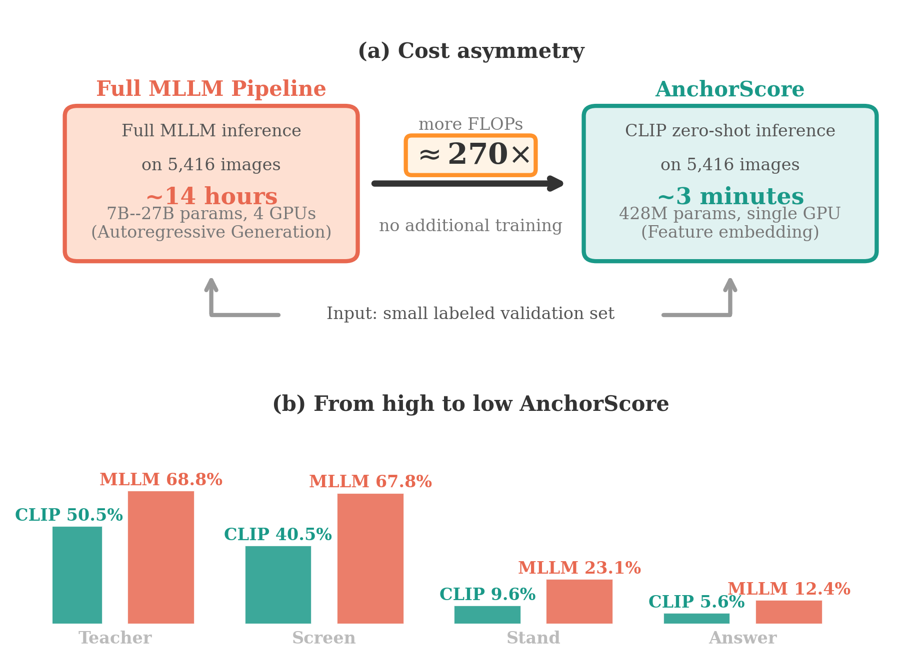
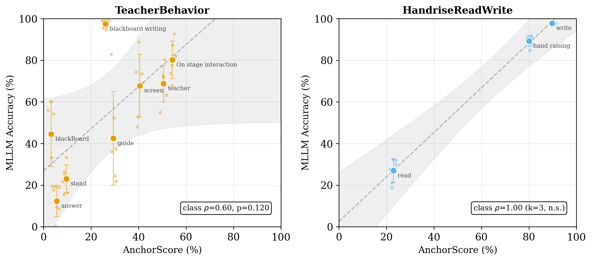
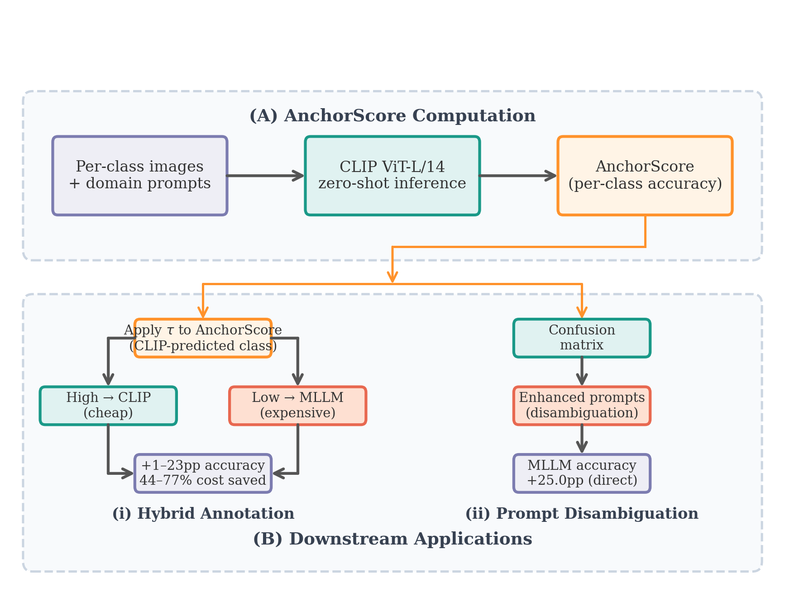

# AnchorScore: A CLIP-Based Diagnostic of MLLM Annotation Difficulty in Classroom Behavior Analysis

[](LICENSE)
[](https://www.python.org/)
[]()

MLLMs are increasingly used for automated image annotation, but their per-class accuracy varies
widely and is expensive to measure: evaluating one 27B MLLM on 5,416 validation images takes
roughly 14 hours (4 GPUs), while CLIP inference completes in 3 minutes. **AnchorScore** — the
per-class zero-shot accuracy of a frozen CLIP model —
flags the classes MLLMs are least likely to annotate reliably, at a fraction of the cost.



## Key Results

| Result | Value | Evidence |
|--------|-------|----------|
| Class-level correlation (SCB5, 13 classes, 6 MLLMs) | **ρ = 0.769** (p = 0.002) | `results/01_core/correlation/unified_results.json` |
| Replication (Stanford40 Actions, 40 classes) | **ρ = 0.817** (p < 0.001) | `results/02_robustness/stanford40/` |
| Three-study meta-analysis (activity recognition) | **ρ = 0.781**, 95% CI [0.653, 0.865], I² = 3.0% | `results/05_applications/meta_analysis_results.json` (`subgroup_all_scene`) |
| SigLIP / DINOv2 / ResNet-50 baselines | no significant correlation (ρ ≤ 0.201) | `results/01_core/anchor_score_scb5/{siglip,dinov2}_correlation.json`, `results/03_baselines/resnet50_baseline/resnet50_results.json` |

The signal is most consistent with a **shared class-difficulty factor**: a cross-model consensus control shows AnchorScore tracks difficulty shared across CLIP and MLLMs rather than a CLIP-specific mechanism, and its value lies in being a zero-cost cold-start proxy of that shared factor. It supports *ranking* (which classes are relatively harder) rather than *calibration* (exact accuracy estimates); full caveats in the paper.



## Pipeline



**(A)** Per-class images + domain prompts → frozen CLIP (428M, ~3 min) → AnchorScore (per-class
zero-shot accuracy). **(B)** Downstream applications: (i) *hybrid routing* — high-AnchorScore classes
to CLIP, low to MLLM; (ii) *prompt disambiguation* — CLIP confusion matrix guides MLLM prompt
refinements; (iii) *review priority* — AnchorScore ranking predicts which classes most need human
verification.

## Quick Start (Analysis Only)

Lightweight: no GPU, no raw data. All analysis scripts read pre-generated result JSONs committed
in `results/`.

```bash
pip install scipy numpy
python analysis/01_core/unified_correlation.py         # Main ρ, scatter plots
python analysis/01_core/pooled_class_level_correlation.py
python analysis/02_robustness/multi_backbone_correlation.py
python analysis/01_core/class_level_correlation.py
python analysis/03_baselines/baselines_correlation.py
```

## Full Reproduction

### Environment

```bash
pip install torch torchvision open-clip-python scipy Pillow requests
pip install transformers accelerate  # for LLaVA
pip install medmnist                  # for cross-domain
```

### Data Dependencies

| Data | Source | Needed By |
|------|--------|-----------|
| SCB5 (13 classes, ~16k images) | [`wintonYF/SCB-Dataset`](https://huggingface.co/wintonYF/SCB-Dataset) (see `experiments/01_core/download_scb5.py`) | `anchor_scb5`, multi-backbone, active learning |
| SCB5-LLM-202506 (10 cls, 494 imgs) | `wintonYF/SCB-Dataset` | SCB5-LLM experiments |
| EuroSAT RGB | `torchvision.datasets.EuroSAT` (auto) | cross-domain |
| MedMNIST (Blood/Tissue/PathMNIST) | `medmnist` (auto) | cross-domain |

Custom data paths:

- `SCB5_DATA_ROOT` — SCB5 root directory
- `HF_ENDPOINT` — Hugging Face mirror (e.g. `https://hf-mirror.com` in China)

### Experiment Pipeline (Ordered)

```bash
# Step 0: Download SCB5 data (~5.4GB)
python experiments/01_core/download_scb5.py --output_dir datasets_scb
export SCB5_DATA_ROOT=$(pwd)/datasets_scb

# Step 1: Core AnchorScore
python experiments/01_core/anchor_scb5.py

# Step 1b: MLLM annotation (optional, requires a GPU server running Ollama)
# The paper's MLLM accuracy values are also committed as
# results/01_core/paper_data/mllm_full.json, so the analysis-only mode
# above already reproduces the headline ρ without this step.
python experiments/01_core/llava_scb5.py            # LLaVA models (GPU)
python experiments/01_core/scb5_llm_ollama.py       # Ollama VLMs on SCB-LLM (~4 h per model on a 32 GB GPU; see file header)

# Step 2: Downstream analyses
python experiments/02_robustness/anchor_cross_domain.py
python experiments/02_robustness/anchor_scb5_multi_backbone.py
python experiments/05_applications/active_learning_naive.py
python experiments/05_applications/active_learning_capped_b32.py
python experiments/05_applications/active_learning_capped_l14.py
python experiments/04_ablation/prompt_robustness_ablation.py
python experiments/03_baselines/siglip_anchor_scb5.py
python experiments/03_baselines/dinov2_anchor_scb5.py
python experiments/03_baselines/resnet50_baseline_scb5.py
python experiments/03_baselines/vl_baseline_correlate.py --vl-results results/01_core/anchor_score_scb5/siglip_anchor.json

# Step 3: Generate analysis figures and tables
python analysis/01_core/unified_correlation.py
```

### Data Flow

```
experiments/*/*.py  ──(json.dump)──>  results/*.json  ←── analysis/*/*.py
```

- Experiments read raw data, compute results, write to `results/`.
- Analysis scripts read only from `results/`, never from raw data or logs.
- Logs in `logs/` are optional stdout captures (not committed, not consumed by any script).

### Outputs

All paper figures and tables come from:

1. Analysis scripts → summarized JSON in `results/`
2. `paper/generate_figures.py` → `.png` figures in `paper/figures/`
3. LaTeX compilation → `paper/VisualAnchor.pdf`

## Project Structure

```
VisualAnchor/
├── experiments/{01_core,02_robustness,03_baselines,04_ablation,05_applications}/
├── analysis/{01_core,02_robustness,03_baselines,04_ablation,05_applications,06_consensus_control,07_mechanism}/
├── paper/                # LaTeX / paper source
├── results/              # All experiment outputs (tracked in git)
├── logs/                 # Execution logs (gitignored)
└── data/                 # Dataset configs + small auxiliary data
```

`experiments/` and `analysis/` share the same phase layout (`01_core` → `05_applications`), with two
additional analysis-only phases: `06_consensus_control` (cross-model shared-difficulty control) and
`07_mechanism` (confusion-structure transitivity test).

## Experiment Groups

All paths below are relative to the respective directory (e.g. `01_core/anchor_scb5.py` means
`experiments/01_core/anchor_scb5.py`).

| Phase | Scripts |
|-------|---------|
| **01_core** — AnchorScore + primary MLLM correlation | `anchor_scb5.py`, `clip_scb5_predictions.py`, `download_scb5.py`, `llava_scb5.py`, `scb5_llm_ollama.py` |
| **02_robustness** — cross-domain, multi-backbone, Stanford40 | `anchor_cross_domain.py`, `anchor_scb5_multi_backbone.py`, `anchor_stanford40.py`, `cross_domain_{probe,qwen,llava,medclip,self_uncertainty}.py`, `validation_size_ablation.py` |
| **03_baselines** — non-CLIP vision models | `siglip_anchor_scb5.py`, `dinov2_anchor_scb5.py`, `resnet50_baseline_scb5.py`, `blip2_anchor_scb5.py`, `vl_baseline_correlate.py` |
| **04_ablation** — prompt robustness, self-uncertainty | `prompt_robustness_ablation.py`, `prompt_optimization.py`, `self_uncertainty_scb5.py` |
| **05_applications** — active learning, hybrid annotation | `active_learning_{naive,capped_b32,capped_l14}.py`, `hybrid_annotation.py`, `run_prompt_opt_simple.py` |
| **06_consensus_control** *(analysis-only)* — cross-model shared-difficulty control | `consensus_control_exp2.py`, `exp{1,3,4,5}_*.py` |
| **07_mechanism** *(analysis-only)* — confusion-structure transitivity (Mantel test) | `confusion_transitivity.py` |

Scripts are named by research question, not execution order — each is independent and can be run
separately.

## Citation

```bibtex
@article{ma2026anchorscore,
  title={AnchorScore: A CLIP-Based Diagnostic of MLLM Annotation Difficulty in Classroom Behavior Analysis},
  author={Ma, Yan and Zhang, Lizhuo},
  note={Pre-submission manuscript},
  year={2026}
}
```

## License

This project is released under the [MIT License](LICENSE).
